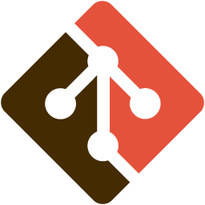
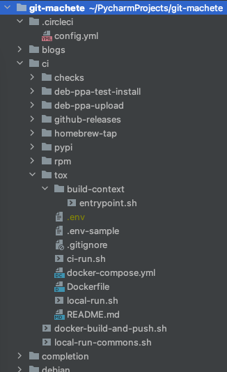
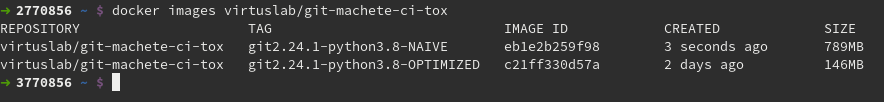

# Nifty Docker tricks for your CI (vol. 1)

If you run dockerized jobs in your CI (or consider migration to the Docker-based flow),
it's very likely that some (if not most) of the techniques outlined in this blog post will prove useful to you.

We'll take a closer look at the CI process for an open source tool, [git machete](https://github.com/VirtusLab/git-machete), that is actively developed at [VirtusLab](https://virtuslab.com/).
Having started as a simple tool for rebase automation, it has now grown into a full-fledged Git repository organizer.
It even acquired its own logo, stylized as the original Git logo with extra forks, slashed in half.



The purpose of the git-machete's CI is to ensure that its basic functions work correctly under
a wide array of Git and Python versions that the users might have on their machines.
In this blog post, we're going to create a dockerized environment that allows to run such functional tests both locally and on a CI server.
This particular project uses [CircleCI](https://app.circleci.com/pipelines/github/VirtusLab/git-machete), but the entire configuration can be migrated to any other modern CI with minimal effort.

This article assumes that you're familiar with concepts like [Dockerfiles](https://docs.docker.com/engine/reference/builder/)
and [docker-compose](https://docs.docker.com/compose/).


## High-level overview of the setup

Let's start with the project layout (also available [on Github](https://github.com/VirtusLab/git-machete)):



These are the files that are particularly relevant to us:

| File                               | Responsibility                                                                 |
| ---                                | ---                                                                            |
| .circleci/config.yml               | Tells the CI to launch ci/tox/ci-run.sh                                        |
| ci/tox/ci-run.sh                   | Runs docker-compose pull/build/push/up commands                                |
| ci/tox/docker-compose.yml          | Provides configuration for building the Docker image and running the container |
| ci/tox/Dockerfile                  | Stores recipe on how to build the Docker image                                 |
| ci/tox/build-context/entrypoint.sh | Serves as the entrypoint for the container                                     |


## Reducing image size: keep each layer small

The central part of the entire setup is the [Dockerfile](https://github.com/VirtusLab/git-machete/blob/master/ci/tox/Dockerfile).
Let's first have a look at the part responsible for Git installation:

```dockerfile
ARG git_version
RUN set -x \
    && apk add --no-cache --virtual=git-build-deps alpine-sdk autoconf gettext wget zlib-dev \
    && wget -q https://github.com/git/git/archive/v$git_version.tar.gz \
    && tar xzf v$git_version.tar.gz \
    && rm v$git_version.tar.gz \
    && cd git-$git_version/ \
    && make configure \
    && ./configure \
    && make \
    && make install \
    && cd .. \
    && rm -r git-$git_version/ \
    && git --version \
    && apk del git-build-deps \
    && rm -rfv /usr/local/bin/git-shell /usr/local/share/git-gui/ \
    && cd /usr/local/libexec/git-core/ \
    && rm -fv git-credential-* git-daemon git-fast-import git-http-backend git-imap-send git-remote-testsvn git-shell
```

We'll discuss the parts that have been skipped in the [second part of this post](https://medium.com/virtuslab/nifty-docker-tricks-for-your-ci-vol-2-c5191a67f1a4) when dealing with non-root user setup.

The purpose of these commands is to install a specific version of Git.
The non-obvious step here is the very long chain of `&&`-ed shell commands under `RUN`, some of which, surprisingly, relate to _removing_ rather than installing software (`apk del`, `rm`).
This prompts two questions: why combine so many commands into a single `RUN` rather than split them into multiple `RUN`s; and why even remove any software at all?

Docker stores the image contents in layers that correspond to Dockerfile instructions.
If an instruction (such as `RUN` or `COPY`) adds data to the underlying file system
(which, by the way, is usually [OverlayFS](https://docs.docker.com/storage/storagedriver/overlayfs-driver/) nowadays),
these data, even if removed in a subsequent layer, will remain part of the intermediate layer that corresponds to the instruction, and will thus make their way to the final image.

If a piece of software (like `alpine-sdk`) is only needed for building the image but not for running the container, then leaving it installed is an utter waste of space.
A reasonable way to prevent the resulting image from bloating
is to remove unnecessary files in the very same layer in which they were added.
Hence, the first `RUN` instruction installs all the compile-time dependencies of Git (`alpine-sdk autoconf gettext wget zlib-dev`),
only to remove them (`apk del`) later in the same shell script.
What remains in the resulting layer is just the Git installation that we care for,
but not the toolchain it was built with (which would be useless in the final image).

A more na&iuml;ve version of this Dockerfile, in which all the dependencies are installed at the very beginning and never removed, yields an almost 800 MB behemoth:



After including the `apk del` and `rm` commands, and squeezing the installations and removals into the same layer,
the resulting image shrinks to around 150-250 MB, depending on the exact versions of Git and Python.
This makes the images caches far less space-consuming.

As a side note, if you're curious how I figured out which files (`git-fast-import`, `git-http-backend` etc.) can be removed from /usr/local/libexec/git-core/,
take a look at [dive](https://github.com/wagoodman/dive), an excellent tool for inspecting files that reside within each layer of a Docker image.


## Making the image reusable: mount a volume instead of `COPY`

It would be very handy if the same image could be used to test multiple versions of the code without having to rebuild the image.
In order to achieve that, the Dockerfile doesn't bake the entire project directory into the image with a  `COPY` command (only the entrypoint script is directly copied).
Instead, the codebase is mounted as a volume within the container.
Let's take a closer look at [ci/tox/docker-compose.yml](https://github.com/VirtusLab/git-machete/blob/master/ci/tox/docker-compose.yml),
which provides the recipe on how to configure the image build and how to run the container.

```yaml
version: '3'
services:
  tox:
    image: gitmachete/ci-tox:git${GIT_VERSION}-python${PYTHON_VERSION}-${DIRECTORY_HASH:-unspecified}
    build:
      context: build-context
      dockerfile: ../Dockerfile # relative to build-context
      target: ${TARGET:-circle_ci}
      args:
        - user_id=${USER_ID:-0}
        - group_id=${GROUP_ID:-0}
        - git_version=${GIT_VERSION:-0.0.0}
        - python_version=${PYTHON_VERSION:-0.0.0}
        - check_coverage=${CHECK_COVERAGE:-false}
    volumes:
      # Host path is relative to current directory, not build-context
      - ../..:${MOUNT_POINT:-/root}/git-machete
```

We'll return to the `image:` section and explain the origin of `DIRECTORY_HASH` later, as well as `target:` section
and define `TARGET` and `MOUNT_POINT` environment variables.

As the `volumes:` section shows, the entire codebase of git-machete is mounted under /home/ci-user/git-machete/ (/root/git-machete/ on CircleCi) inside the container.
The variables `PYTHON_VERSION` and `GIT_VERSION`, which correspond to `python_version` and `git_version` build args,
are provided by CircleCI based on the configuration in [.circleci/config.yml](https://github.com/VirtusLab/git-machete/blob/master/.circleci/config.yml). Below there is a snippet of this configuration with definition of a one CircleCI `job` named `tests_py38`. In its second step job runs bash command `ci/tox/ci-run.sh` with environment variables `PYTHON_VERSION=3.8` and `GIT_VERSION=2.25.0` (for more information about passing running bash script with environment variables see [link](https://virtuslab.github.io/tips/#shell/passing-environment-vars)):

```yaml
# ... skipped ...

  tests_py38:
    executor: ubuntu_executor
    steps:
      - checkout
      - run:
          name: Run tests against Python 3.8 and git 2.25.0
          command: PYTHON_VERSION=3.8 GIT_VERSION=2.25.0 bash ci/tox/ci-run.sh

# ... skipped ...
```

The part of the pipeline that actually uses the contents of the mounted volume
is defined in the [ci/tox/build-context/entrypoint.sh](https://github.com/VirtusLab/git-machete/blob/master/ci/tox/build-context/entrypoint.sh) script
that is `COPY`-ed into the image:

```shell script
#!/bin/sh

{ [ -f setup.py ] && grep -q "name='git-machete'" setup.py; } || {
  echo "Error: the repository should be mounted as a volume under $(pwd)"
  exit 1
}

set -e -u -x

if [[ $CHECK_COVERAGE = true ]]; then
  TOX_ENV_LIST="pep8,coverage"
else
  TOX_ENV_LIST="pep8,py${PYTHON_VERSION/./}"
fi

tox -e $TOX_ENV_LIST

$PYTHON setup.py install --user
git machete --version
```

This script first checks if the git-machete repo has really been mounted under the current working directory, then fires
the all-encompassing [`tox`](https://tox.readthedocs.io/en/latest/) command that runs code style check, tests, coverage etc.

In the [second part of the series](https://medium.com/virtuslab/nifty-docker-tricks-for-your-ci-vol-2-c5191a67f1a4), we will cover a technique for caching the images with great efficiency.
We will also ensure that the files created by the running container inside the volume are not owned by root on the host machine.
