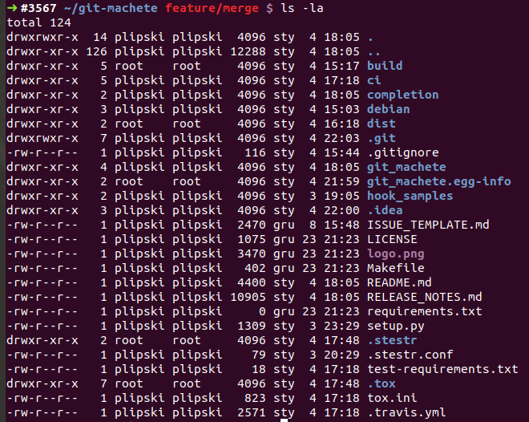
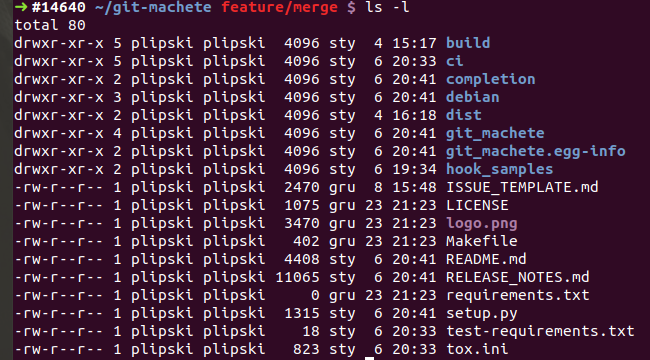

# Nifty Docker tricks for your CI (vol. 2)

The [first part of the series](https://medium.com/virtuslab/nifty-docker-tricks-for-your-ci-vol-1-c4a36d2192ea) outlined the techniques for reducing the image size,
as well as avoiding the need to rebuild the image every time when the codebase changes.
Let's continue with further Docker-related CI tricks, as showcased in [git-machete](https://github.com/VirtusLab/git-machete)'s CircleCI setup.

## Caching the images: make use of Docker tags

It would be nice to cache the generated images, so that CI doesn't build the same stuff over and over again.
By the way, the purpose of the extreme image size optimization outlined [in the previous part](https://medium.com/virtuslab/nifty-docker-tricks-for-your-ci-vol-1-c4a36d2192ea) is also to facilitate caching.

Think for a moment what exactly causes one generated image to be different from another.
We obviously have to take into account the versions of Git and Python &mdash; passing different combinations of these will surely result in a different final image.
Therefore, the Docker image tag should include the information about these versions in order to make the caching possible.

But with respect to the project files... since it's `ci/tox/build-context` that's passed as build context,
the Dockerfile doesn't know anything about the files from outside that directory!
This means that even though other files change as the project is being developed,
we could theoretically use the same image if `ci/tox/build-context` remains untouched.
Note that the build context usually changes very rarely compared to the actual source files.

There's a catch here, though.
The build context is not the only thing that can affect the final Docker image.
A change to the `Dockerfile` itself can obviously lead to a different result,
but modification to `docker-compose.yml` and even the scripts that run `docker-compose` may also influence the result e.g. by changing environment variables and/or values passed as arguments.
But since all those files reside under `ci/tox/`, this doesn't make things much worse &mdash;
the entire resulting build image depends only on the contents of `ci/tox/` directory instead of `ci/tox/build-context/`
(with one exception that packages installed via `apk` can also get updated over time in their respective APK repositories).

Therefore, the image can be uniquely identified by the hash of its `ci/tox/` directory.
We don't even need to derive that hash manually, because git computes an SHA-1 hash for each object it stores.
It's a well known fact that every commit has a unique hash, but actually SHA-1 hashes are also derived for each file (called a _blob_ in gitspeak) and each directory (called a _tree_).
The hash of a tree is based on the hashes of all of its nested blobs and subtrees.
More details can be found in [this slide deck on git internals (aka "git's guts")](https://slides.com/plipski/git-internals/).
For our use case, it means that any change to the files inside `ci/tox/` will yield a new Docker image tag.

To get the hash of a given directory within the current commit (HEAD),
we can use a plumbing command called `rev-parse`:

```shell script
git rev-parse HEAD:ci/tox
```

The argument has the form `<revision>:<path>`, same as in `git show`.

Note that this hash is NOT the same as the hash of the resulting Docker image.
Also, git object hashes are 160-bit (40 hex digit) SHA-1 hashes, while Docker identifies images by their 256-bit (64 hex digit) SHA-256 hash.

Back into [ci/tox/docker-compose.yml](https://github.com/VirtusLab/git-machete/blob/master/ci/tox/docker-compose.yml) for a moment:

```yaml
version: '3'
services:
  tox:
    image: gitmachete/ci-tox:git${GIT_VERSION}-python${PYTHON_VERSION}-${DIRECTORY_HASH:-unspecified}
# ... skipped ...
```

We already know that `GIT_VERSION` and `PYTHON_VERSION` are set up directly by CircleCI based on values specified in `.circleci/config.yml`.
Let's peek into [ci/tox/ci-run.sh](https://github.com/VirtusLab/git-machete/blob/develop/ci/tox/ci-run.sh) to see where `DIRECTORY_HASH` comes from:

```shell script
# ... skipped ...

source ci/docker-pull-or-build-and-push.sh tox

# ... skipped ...
```
There is no definition of a `DIRECTORY_HASH` in here, but there is an execution of a [ci/docker-pull-or-build-and-push.sh](https://github.com/VirtusLab/git-machete/blob/develop/ci/docker-pull-or-build-and-push.sh) with `tox` argument in which we can see the definition:

```shell script
# ... skipped ...
image_name=$1

DIRECTORY_HASH=$(git rev-parse HEAD:ci/$image_name)
export DIRECTORY_HASH
cd ci/$image_name/

# If image is not found by pull, build the image and push it to the Docker Hub.
docker-compose pull $image_name || {
  docker-compose build --build-arg user_id="$(id -u)" --build-arg group_id="$(id -g)" $image_name
  # In builds coming from forks, secret vars are unavailable for security reasons; hence, we have to skip pushing the newly built image.
  if [[ ${DOCKER_PASSWORD-} && ${DOCKER_USERNAME-} ]]; then
    echo "$DOCKER_PASSWORD" | docker login -u "$DOCKER_USERNAME" --password-stdin
    docker-compose push $image_name
  fi
}
```

Once we've got the directory hash, we check (`docker-compose pull`) whether the image with the given tag is already present
in the [virtuslab/git-machete-ci-tox repository on Docker Hub](https://hub.docker.com/r/virtuslab/git-machete-ci-tox/tags).

If there is no previous build for the given combination of Git version, Python version and contents of ci/tox directory,
`docker-compose pull` would return a non-zero exit code, although this can also mean a failure of the pull operation.
In either case, we need to construct the image from scratch.

Note that `docker-compose build` accepts additional arguments, namely `user_id ` and `group_id`; we'll explain their purpose in the next section.

Once the image is built, we log in to Docker Hub and perform a `docker-compose push`.
A little catch here: CircleCI provides option to forbid the use of secret variables in builds that are triggered by forks. Even though CircleCI masks the _exact matches_ of a secret value in build logs, it can't prevent a malicious "contributor" from printing e.g. base64-encoded
(or otherwise reversibly transformed) secret, which would constitute an obvious security breach.
Thus, we need to make sure that the Docker credentials are indeed available in the environment; if that's not the case, we refrain from pushing the image.

It is not strictly necessary to use `docker-compose`, but this saves us from specifying the same parameters over and over again.
If we were to use just plain `docker pull/build/push` instead of their `docker-compose` counterparts,
we'd need to supply parameters such as the image name and tag every single time.

Once we have the image in place (either pulled from Docker Hub or built from scratch),
running the tests is easy, see [ci/tox/ci-run.sh](https://github.com/VirtusLab/git-machete/blob/develop/ci/tox/ci-run.sh):

```shell script
# ... skipped ...

docker-compose --ansi never run tox
```

## Running the build locally: configure a non-root user

To run the tests locally execute:

```shell script
cd ci/tox
cp .env-sample .env  # and optionally edit if needed to change git/python version
./local-run.sh
```

[ci/tox/local-run.sh](https://github.com/VirtusLab/git-machete/blob/develop/ci/tox/local-run.sh) is somewhat similar to how things are run on CircleCI:

```shell script
# ... skipped ...

source ../local-run-commons.sh tox

export_directory_hash tox
cd "$(git rev-parse --show-toplevel)"/ci/tox/
check_var GIT_VERSION
check_var PYTHON_VERSION

set -x
export TARGET=local
export MOUNT_POINT=/home/ci-user
docker-compose build --build-arg user_id="$(id -u)" --build-arg group_id="$(id -g)" tox
docker-compose run tox

```

The difference is just additional sanity checks like whether variables are defined (`check_var`) and whether there are any uncommitted changes (part of responsibilities of `export_directory_hash`).
Also, we don't attempt to push the freshly-built image to the Docker Hub since we can rely on a local build cache instead.
We also export `TARGET` and `MOUNT_POINT` environment variables to be used to decide which stage of Dockerfile to build.

Our entire setup assumes that the git-machete directory from the host is mounted as a volume inside the Docker container
(as described in detail in [part 1](https://medium.com/virtuslab/nifty-docker-tricks-for-your-ci-vol-1-c4a36d2192ea)).
Every command in the Docker container is by default executed with root user privileges.
As a consequence, any new file that the container creates inside the mounted volume will be owned by root not only in the container... but also on the host!
This leads to a very annoying experience: all the files that are usually generated by the build (like build/ and dist/ directories in case of Python, or target/ for JVM tools)
will belong to root.



If only Docker had an option to run commands as a non-root user...

Let's take a look at [ci/tox/docker-compose.yml](https://github.com/VirtusLab/git-machete/blob/master/ci/tox/docker-compose.yml) again,
especially at the `target` and `volumes` sections that are defined by the `TARGET` and `MOUNT_POINT` environment variables.
```yaml
version: '3'
services:
  tox:
    image: gitmachete/ci-tox:git${GIT_VERSION}-python${PYTHON_VERSION}-${DIRECTORY_HASH:-unspecified}
    build:
      context: build-context
      dockerfile: ../Dockerfile # relative to build-context
      target: ${TARGET:-circle_ci}
      args:
        - user_id=${USER_ID:-0}
        - group_id=${GROUP_ID:-0}
        - git_version=${GIT_VERSION:-0.0.0}
        - python_version=${PYTHON_VERSION:-0.0.0}
        - check_coverage=${CHECK_COVERAGE:-false}
    volumes:
      # Host path is relative to current directory, not build-context
      - ../..:${MOUNT_POINT:-/root}/git-machete
```

as well as at [ci/tox/Dockerfile](https://github.com/VirtusLab/git-machete/blob/develop/ci/tox/Dockerfile), this time at the bottom part:
```dockerfile
ARG python_version
FROM python:${python_version}-alpine as base
# ... git & python setup - skipped ...

FROM base AS circle_ci
RUN $PYTHON -m pip install tox
ENV PATH=$PATH:/root/.local/bin/
COPY entrypoint.sh /root/
RUN chmod +x /root/entrypoint.sh
CMD ["/root/entrypoint.sh"]
WORKDIR /root/git-machete

FROM base AS local
ARG user_id
ARG group_id
RUN set -x \
    && [ ${user_id:-0} -ne 0 ] \
    && [ ${group_id:-0} -ne 0 ] \
    # sometimes the given `group_id` is already taken and `addgroup` raises an error, so let's check its existence first
    && (getent group $group_id || addgroup --gid=${group_id} ci-user) \
    && adduser --uid=${user_id} --ingroup=$(getent group $group_id | cut -d: -f1) --disabled-password ci-user
USER ci-user
RUN $PYTHON -m pip install --user tox
ENV PATH=$PATH:/home/ci-user/.local/bin/
COPY --chown=ci-user:ci-user entrypoint.sh /home/ci-user/
RUN chmod +x ~/entrypoint.sh
CMD ["/home/ci-user/entrypoint.sh"]
WORKDIR /home/ci-user/git-machete

```

In order to be able to use **non-root user** for local runs and **root user** for the CI/CD runs on CircleCI's host machines,
we used multi-stage builds. Single Dockerfile stage is defined with `FROM` <base_stage_being_build_upon> `AS` <name_of_the_new_stage> and executes each statement
until the next `FROM` - defining a new stage.

We can select which stage to build using docker-compose's `target` argument. \
e.g. when the `TARGET=local` and `MOUNT_POINT=/home/ci-user`,
the `circle_ci` stage is skipped and `local` stage gets build (and each stage it depends upon, which in this case is `base`)

### Run locally as a non-root user
The trick is to create a new user with the same user and group ID as your user on the local machine.
This is accomplished by
`docker-compose build --build-arg user_id="$(id -u)" --build-arg group_id="$(id -g)" tox`
in `ci/tox/local-run.sh`.

We switch from default `root` to the newly-created user by calling `USER ci-user`.

Using rather unusual syntax (Unix-style `--something` options are rarely passed directly to a Dockerfile instruction), we need to specify `--chown` flag for `COPY`.
Otherwise, the files would end up owned by `root:root`.
The preceding `USER` instruction, unfortunately, doesn't affect the default owner of `COPY`-ed (or `ADD`-ed, for that matter) files.

The fact that the files created by `ci-user` within the container also belong to an existing user in the host system may seem confusing.
Where does this correspondence come from, especially if the host doesn't have a user or group named `ci-user`?

Well, actually it's the numeric ID of user/group that matters.
User names on Unix systems are just aliases, and the same user ID may have different names assigned on the host system and inside the container.
As a consequence, even if there was indeed a user called `ci-user` on the host machine,
that still wouldn't matter from the perspective of ownership of files generated within a container &mdash;
the only thing that matters is the numeric ID.

After launching `./local-run.sh` we can see that all files generated inside the volume are owned by the current host user:




## Next steps

We advise to also get familiar with an alternative technique for reducing image size called
[multistage builds](https://docs.docker.com/develop/develop-images/multistage-build/).
It takes less work to remove the packages and files that are no longer necessary once the build is complete, than to copy between the stages the ones that are relevant.

More details on the git-machete tool itself can be found in the usage guide:
[part 1 (basic usage)](https://medium.com/virtuslab/make-your-way-through-the-git-rebase-jungle-with-git-machete-e2ed4dbacd02)
and [part 2 (advanced features)](https://medium.com/virtuslab/git-machete-strikes-again-traverse-the-git-rebase-jungle-even-faster-with-v2-0-f43ebaf8abb0).

Contributions (and stars on [Github](https://github.com/VirtusLab/git-machete)) are more than welcome!
