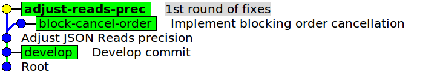
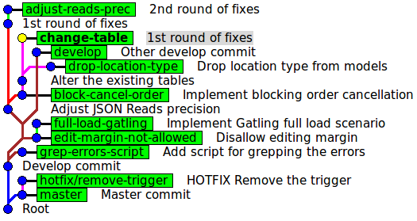
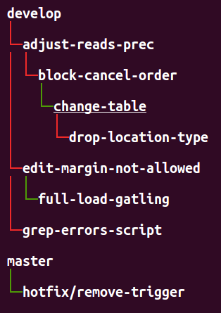
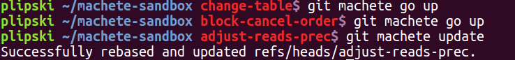
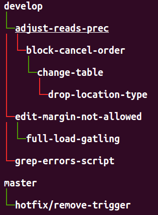
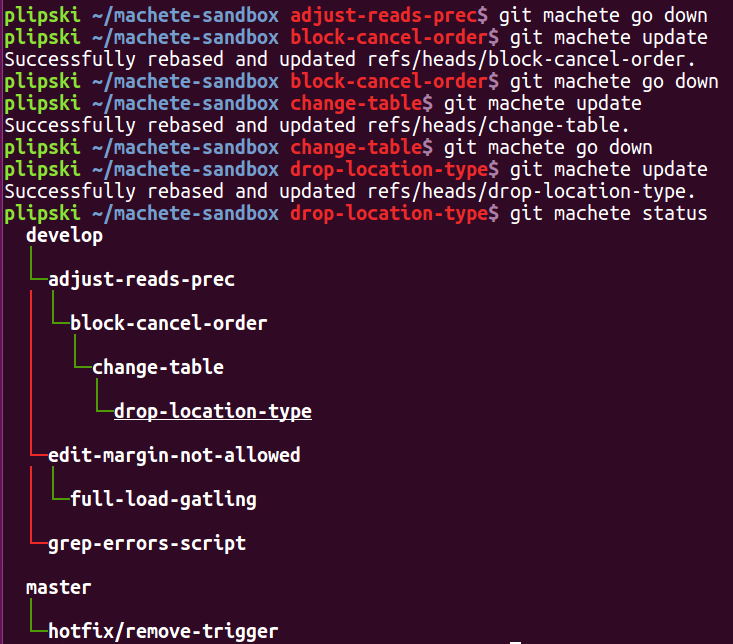
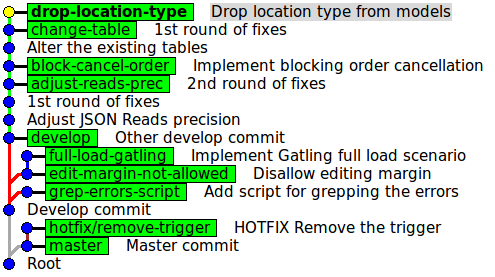
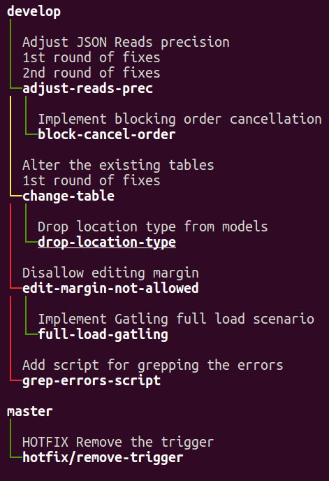

# Make your way through the git (rebase) jungle with `git machete`!

TL;DR: If you work a with a git rebase flow, `git machete` will (vastly!) help you manage the jungle of branches stacking on top of each other when you're, for example, working on a couple of different PRs in parallel.


## The problem

In day-to-day development it is common that for various reasons coders have to work with multiple git branches at the same time.
I'll show a repository with a bunch of topic branches so as to demonstrate the typical problems that can occur under such conditions
and how a few nifty cuts of `git machete` will prevent us from getting into a complete _git jungle_.
The example I'm about to provide is deliberately exaggerated - in fact, most likely you'll have at most 3 or 4 branches developed simultaneously.
Still, `git machete` is significantly helpful, even in less complex scenarios.

Let's assume you have implemented a fix on a branch `adjust-reads-prec` (the actual content of the fix is completely irrelevant) and made a pull request to `develop`.
While the PR was under review, you started work on another topic branch `block-cancel-order`.

Unfortunately, the changes that you intended to introduce on `block-cancel-order` depended on what had already been done on `adjust-reads-prec`...
So you forked a new branch (`block-cancel-order`) off `adjust-reads-prec` and, when the change was ready, you made another PR, this time for `block-cancel-order` to `adjust-reads-prec`.

In the meantime, reviewers posted their comments on the first PR.
You applied their remarks as a `1st round of fixes` commit on the `adjust-reads-prec` branch.

Let's see how the state of the repo looks in a graphical tool like `gitk`:



In most cases it's rather unusual to have more than 2 branches stacked on top of each other, but for the sake of completeness let's now make this chain longer.
You developed a couple of new refactors and bug fixes - say, on branches `change-table` and `drop-location-type`.
As each of them was dependent on changes already waiting in the review queue, you began stacking another branches on top of each other.
You ended up having 4 branches in the chain, each dependent on the previous one: `adjust-reads-prec`, `block-cancel-order`, `change-table` and `drop-location-type`.

Now for the sake of providing a full-fledged example, let's also add a couple of other branches (not related to the 4-branch chain) to our scenario.
Let's assume you also independently developed a feature `edit-margin-not-allowed` and later derived a branch `full-load-gatling` from that point.
Also, you created a branch `grep-errors-script` that (fortunately!) nothing depended on, and a `hotfix/remove-trigger` branch, but on top of `master`, not `develop`.

If you'd like to quickly recreate this repository state on your local machine, you can use [this handy script (link)](https://raw.githubusercontent.com/PawelLipski/git-machete-blog/master/sandbox-setup.sh),
which will set it up in `machete-sandbox` directory in your home folder.

Now the problem: how to quickly check which of the branches are in sync with their parent (aka upstream) branches?
Note that for some of them (like `adjust-reads-prec` or `hotfix/remove-trigger`) this parent would simply be `develop` or `master`, but for others (like `change-table`) this would be another topic branch.
Also, how to easily rebase each branch on the top of its parent, especially when dependencies between branches have changed from the description above, or some branches have been deleted, and so on?


## Defining a structure for the branches (`edit` subcommand)


Okey, let's get our hands dirty... first install `git-machete` with the following sequence of commands that you can also find in the README of
[the git machete repo (github.com/VirtusLab/git-machete)](https://github.com/VirtusLab/git-machete).

```bash
$ git clone https://github.com/VirtusLab/git-machete.git
$ cd git-machete
$ sudo make install
```

This will copy the `git-machete` Python 2.7 executable to `/usr/local/bin` and set up a corresponding Bash completion script in `/etc/bash_completion.d`.

Once you have `git-machete` in your executable `PATH` (and thus git already recognizes the `machete` subcommand), let's specify how you would like to organize your branches - basically, what depends on what.
Run `git machete edit` or simply open the `.git/machete` file with your favorite editor.
Paste the following "branch tree" definition:
```
develop
    adjust-reads-prec
        block-cancel-order
            change-table
                drop-location-type
    edit-margin-not-allowed
        full-load-gatling
    grep-errors-script
master
    hotfix/remove-trigger
```

The above content defines a tree-like structure where `develop`/`master` are the roots.
`adjust-reads-prec` depends directly on the `develop` branch, `block-cancel-order` depends directly on `adjust-reads-prec` and thus also (indirectly) on `develop`, and so on -
just as defined verbally earlier in the post.

(Tip: it's okay to use tabs or any number of spaces for indenting as long as you are consistent).

Now you've defined the structure of how the branches should relate to each other.
Unfortunately, some of the branches aren't really in sync with the defined structure.
For example, a few pull requests from other team members were merged into `develop` in the meantime,
so `adjust-reads-prec`, `edit-margin-not-allowed` and `grep-errors-script` now need to be synced with `develop`
(you'll possibly have to solve some conflicts during the rebase, but that's irrelevant for our discussion).

Also, your PRs for `adjust-reads-prec` and `change-table` received a couple of further comments which you then fixed on separate commits,
thus throwing `block-cancel-order` and `drop-location-type`, respectively, out of sync with their upstream branches.

Let's see how the state of the repo looks now:



And... this is exactly the _jungle_ in which `git machete` comes to the rescue.


## What's macheting really about... `status`, `go` and `update`


Let's now run `git machete status` to see the current state of which branches are synced with their upstreams and which ones aren't:



What you see now is basically a neatly printed branch tree, with edges colored red or green.
`change-table` is underlined since it happens to be the currently checked out branch.

A red edge leading to a child/downstream branch means that this branch is out of sync with its parent/upstream branch (not a direct descendant in the git commit graph) and needs to be rebased onto the parent.

A green edge means that the downstream branch is in sync with the parent.

This leads to a somewhat disappointing conclusion that only 3 (`change-table`, `full-load-gatling` and `hotfix/remove-trigger`) out of your 8 topic branches are synced with their upstreams branches...
but fear not, you'll get it sorted soon!

But before you do, let's also run `git machete status --list-commits` (or `git machete s -l` for short) to print the commits introduced on each branch:


An important note here: what you see here for each branch is actually the part of commit history that's unique to this branch.
In other words, for each branch `git machete status --list-commits` only lists the commits that were (most likely) introduced on this very branch and not on any other.
To determine this piece of commit history, `git machete` finds a _fork point_ which can be loosely defined as the commit at which the history of the branch actually diverges from the history of any other branch.
Then, `status --list-commits` lists everything that follows after the fork point.
Finding this special place in the history is more difficult than it could seem at first glance... look at [the appendix section below](#appendix-fork-point---not-so-easy-business) if you are interested in more details.

Let's now check out `adjust-reads-prec` and put it back in sync with `develop`.
You can first use a handy subcommand `git machete go <direction>` that helps navigate the tree by checking out a branch specified by a direction
(`up` in this case, but `down`, `next`, `prev` or `root` are also possible).
Then you can do the actual rebase (with automagically set up parameters, no need to worry about the super-unintuitive `git rebase` CLI!) by `git machete update`.



I didn't include this in the screenshot above, but in the meantime git has displayed a standard interactive rebase TODO list that includes the 3 commits that were about to be moved onto `develop`.
You could do all the actions allowed during an interactive rebase, such as squashing commits, editing the commit messages etc.
Of course, you could even cancel the entire operation by clearing the rebase TODO list.

Now let's see the status:



`adjust-reads-prec` is now in sync with `develop`!

Unfortunately, the inevitable consequence is that the downstream branch `block-cancel-order` is now out of sync with `adjust-reads-prec`...
but wait, what prevents you from applying an `update` to the following downstream branches as well?

Let's go down the git jungle (with a handy shortcut `git machete go down`) and rebase the downstream branches one by one onto their already rebased parents:



You see that now all the 4 branches in the longest chain are synced to each other and to `develop`.
Let's confirm (with `gitk`) that all branches are neatly lined up:



Of course you'll still need to sync `edit-margin-not-allowed`, `full-load-gatling` and `grep-errors-script` to `develop`... but the process would be pretty similar to what you just did before.

As the cherry on top, let's now assume that you need to merge the `change-table` branch to `develop` as soon as possible
and you can't wait for `adjust-reads-prec` and `block-cancel-order` to get merged first.
Unfortunately, the two mentioned upstream branches introduced some nice helpers that you later used in `change-table`.
To make the process as painless as possible, let's modify the definition file with `git machete edit`:

```
develop
    adjust-reads-prec
        block-cancel-order
    change-table
        drop-location-type
    edit-margin-not-allowed
        full-load-gatling
    grep-errors-script
master
    hotfix/remove-trigger
```



When you modified the definition file, `git machete status` marked the edge between `develop` and `change-table` as yellow.
This means that the downstream branch (`change-table`) is still in sync with the upstream (`develop`), but the upstream branch tip isn't the fork point of the downstream branch.
Translating from _git-ese_ to English, there are probably commits from some other branches on the way between `develop` and `change-table`;
this is exactly the case now (there are indeed commits originating on `adjust-reads-prec` and `block-cancel-order`).
You won't come across the yellow edges very often in day-to-day work with `git machete` - it mostly happens when the tree structure has been surgically modified, as you did just a moment ago.

Anyway, since the edge is not green as it should be, you can now run `git machete update` to rebase `change-table` directly onto `develop`.
Most likely you'll need to resolve the conflicts (since you're now basically trying to skip the commits introduced by `adjust-reads-prec` and `block-cancel-order` from the history of `change-table`)
and you'll surely need to later rebase `drop-location-type` onto `change-table`.
Nonetheless, all it takes is just two `git machete update`s instead of complicated `git rebase`s with 3 parameters!

For the sake of simplicity I didn't mention it in the above section, but if you had a corresponding remote repository,
`git machete status` would also print out an `(out of sync with origin)` annotation next to the branches that are not synced with their remote counterparts.
They most likely need to be pushed to the remote at some point (possible with `--force`, in particular if they were rebased since the last push).
Note that this notion of _remote-syncness_ is completely orthogonal to their _parent-syncness_: a branch can be in sync with the remote counterpart but not with the local parent/upstream branch, and vice versa.
Also, to be considered in sync with remote, a branch must be _commit-wise equal_ to the remote counterpart,
while for parent-syncness it's enough for branch commit to be a _direct descendant_ of the parent branch commit.


## A few other useful hacks... `diff`, `add`, `reapply` and `slide-out`

To see the changes introduced on the current branch, run `git machete diff`.
This will compare the current working directory to the fork point commit of the current branch.
You can also provide a branch parameter (`git machete diff <branch>`) to see the diff of the given branch against its fork point.

`git machete add [--onto=<target-upstream>] [<branch>]` adds the specified branch (or the current one, if skipped) onto the given target upstream branch.
The same effect can also be achieved by editing the definition file `.git/machete` manually e.g. with `git machete edit`.
For example, if you run `git branch ignore-whitespace` and then `git machete add --onto=block-cancel-order ignore-whitespace`, you'll end up with the following definition file:

```
develop
    adjust-reads-prec
        block-cancel-order
            ignore-whitespace
    change-table
        drop-location-type
    edit-margin-not-allowed
        full-load-gatling
    grep-errors-script
master
    hotfix/remove-trigger
```

`reapply` is similar to `update`, but instead of rebasing the commits onto the upstream branch, it instead (also interactively) rebases them onto the fork point of the current branch.
This means that the rebase operation will change nothing in the relation between the current branch and its upstream branch: if the branches weren't in sync before, they still won't be.
The main use of `reapply` is squashing or otherwise reorganizing the commits _within the current branch_, rather than moving those commits _onto the upstream branch_ (as `update` does).

The `slide-out` subcommand is somewhat tricky.
Let's assume the `edit-margin-not-allowed` branch was already merged to develop and you no longer need to retain it locally.
What you most likely want to do now is remove `edit-margin-not-allowed` from the tree and then rebase its downstream branch `full-load-gatling`
onto `edit-margin-not-allowed`'s original upstream (i.e. `develop`).
Since that's a pretty common combination of actions, there's a shortcut for that, namely `git machete slide-out [<branch>]`:


All commands supported by `git machete` can be found under `git machete help`.
Run `git machete help <command>` for more specific documentation for the given command.

As a general parting thought, if anything goes wrong during the rebase, always remember you can turn to `git reflog [<branch>]` for help... nothing that's committed in git gets lost (at least not easily).


## Appendix: fork point - not so easy business...


The fork point commit (the commit at which the history of the branch diverges from the history of any other branch) is determined with a heuristics that uses `git reflog`.
The *commit-wise* history (aka `git log`) of the given branch is compared with the *operation-wise* history (aka `git reflog`) of all other local branches.
Roughly speaking, the most recent commit `C` from the log of branch `x` that also happens to appear on the reflog of any other local branch `y` is considered the fork point of branch `x`.
Intuitively, the fact that `C` was found somewhere in the reflog of `y` suggests that it was originally committed on `y` and not on `x`
(even though it might no longer appear on `y`'s log due to e.g. rebases or commit amendments).

This definition, though working correctly in most real-life cases, might still sometimes fail to find a _logically_ correct fork point commit.
In particular, if certain local branches were already deleted, the fork point may be found _too early_ in the history compared to what's expected, or might even be not found at all.

It's always possible to explicitly check what a fork point for a given branch would be through `git machete fork-point [<branch>]`,
or to simply list commits considered by `git machete` to be "specific" to the each branch with `git machete status --list-commits`.

Anyway, the potentially undesired effects of `git machete` failing to find a correct fork point are mitigated in some ways:
* The three commands that run `git rebase` under the hood (`reapply`, `slide-out` and most notably `update`) always pass the `--interactive` flag.
  This enables the user to review the list of commits that are going to be rebased before the actual rebase is executed, or even cancel the rebase by clearing out the rebase TODO list.
* It's also possible to explicitly specify the fork point for the three aforementioned commands with `-f`/`--fork-point` (`reapply`, `update`) or `-d`/`--down-fork-point` (`slide-out`).

More git-savvy users may argue that it should be enough to simply use the `--fork-point` option of `git rebase`, but the reality turns out to be harder than that.
`git merge-base --fork-point` (and thus `git rebase` with the said option) only takes the reflog of the one provided upstream branch into account.
This works fine as long as nobody disturbs the structure of the tree in the definition file (i.e. the upstream branch of any branch doesn't change).
Unfortunately, as mentioned before in this post, such tree structure modifications happen pretty often in real-life development, therefore a custom, more powerful way to find the fork point was necessary.

