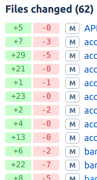
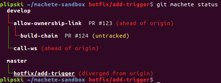
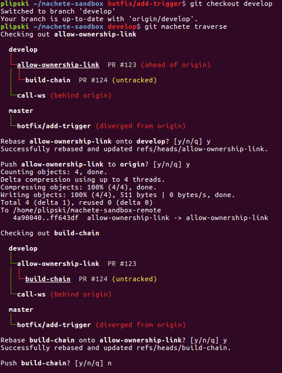
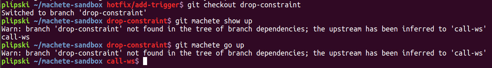
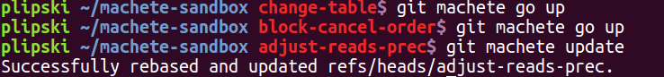
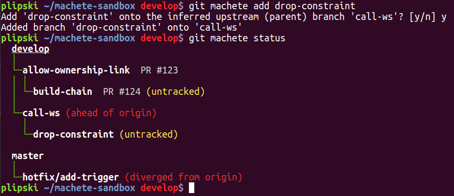
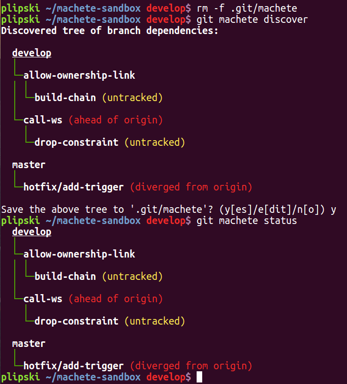

# `git machete` strikes again! Traverse the git (rebase) jungle even faster with v2.0+


## Intro

Good news - git machete 2.0 has been released!

For those of you not familiar with this nifty tool, I recommend having a quick look at the [previous part of this series (link)](https://virtuslab.com/blog/make-way-git-rebase-jungle-git-machete)
or at least scrolling through the screenshots in that blog post to get a TL;DR kind of understanding of what git machete actually does.

In general, git machete is a tool that helps manage multiple branches within a git repository and thus promotes the creation of smaller pull requests that are (usually) easier to review.
Just recall the last time you had to review a giant like this (diff stats shown of course only for a few first files):



You can get the latest git machete release directly from [the git machete repo (github.com/VirtusLab/git-machete)](https://github.com/VirtusLab/git-machete):

```
$ git clone https://github.com/VirtusLab/git-machete.git
$ cd git-machete
$ sudo make install
```

`make install` copies the `git-machete` Python 2.7 executable to `/usr/local/bin` and sets up the corresponding Bash completion script in `/etc/bash_completion.d`.

Some of the latest improvements (especially automatic discovery of branch dependency tree) have been suggested in the [Reddit discussion (link)](https://redd.it/8625a6) for the previous part of the series -
many thanks for the feedback.
Also, special thanks to the GitHub user [sprudent](https://github.com/sprudent), who raised the issue of git machete crashing when run from a git submodule.
Other recent tweaks to git machete were introduced simply to make day-to-day use of the tool even more convenient.

## Demo repository setup

As in the first part of the series, there is a dedicated script that sets up a demo repository with a couple of branches -
you can download it [directly from GitHub (link)](https://raw.githubusercontent.com/PawelLipski/git-machete-blog-2/master/sandbox-setup-2.sh).

A tricky thing about the script is that it actually sets up two repos: one at `~/machete-sandbox` and another one at `~/machete-sandbox-remote`.
The latter is a _bare_ repository that is created with `git init --bare` and hence doesn't have working tree, just a `.git` folder.
This will serve as a dummy remote for the repo under `~/machete-sandbox`.
More specifically, the script runs `git remote add origin ~/machete-sandbox-remote` from `~/machete-sandbox` directory
so as to establish an actual local/remote relation between the repos, with similar push/pull capabilities that are available over HTTPS or SSH.

The initial structure of branches in the demo (i.e., the contents of the `.git/machete` definition file, excluding custom annotations that will be covered soon) is as follows:

```
develop
    allow-ownership-link
        build-chain
    call-ws
master
    hotfix/add-trigger
```

There is also a `drop-constraint` branch; this isn't yet included in `.git/machete` for a good reason that is explained later.


## What PR was for what branch? Custom annotations and improved remote sync-ness status

For most local branches (possibly other than dependency tree roots, like `develop` or `master`), at some point you'll create a pull request on e.g. GitHub or Bitbucket.
It can get pretty inconvenient to "optically" match branch names as displayed by `git branch` or `git machete status` to PRs,
especially in case of Bitbucket, which by default doesn't display source branch names in the PR list, only the destination branch.

To make dealing with auxiliary information such as PR numbers easier, `git machete status` got a simple tweak recently: custom annotations.
Just put any phrase after the branch name, separated with a single space (there's an implicit assumption that you never put spaces in git branch names... if you do, think it over twice!),
and it will be displayed in the output of the `status` subcommand.
To be precise, anything can be placed as annotation, not only a PR number specifically - but PR numbers seem the most natural use case.

The annotations were already set up by the `sandbox-setup-2` script.
Let's run `git machete status`:



The PR numbers are completely arbitrary here since the script obviously didn't create any actual PRs on any external service.

You might also notice that the output slightly changed in terms of the remote sync-ness message.
In earlier versions of git machete it was pretty cumbersome that you couldn't really distinguish between a remotely untracked branch and one that is remotely tracked but not in sync with its remote.
As of v2.0 of git machete, `status` distinguishes between (roughly) the following cases:

* untracked
* in sync with remote
* ahead of origin
* behind origin
* diverged from origin

pretty much just like `git status` does.

Now it's also more consistent with `git status` in that it uses the remote tracking branch information (as set up by `git branch --set-upstream` or `git push --set-upstream`)
to determine the remote counterpart branch, rather than simply prefixing branch names with remote name (like `origin/<branch-name>`).


## Too lazy to think what to rebase next? Traversal of the branch dependency tree

The sequence of steps suggested in the first blog post:

* check out a branch X
* rebase it on the top of its upstream if needed
* push to remote (possibly with `--force`) if needed
* check out another branch - e.g. a child of X

actually repeats pretty often in a daily work with `git machete`, especially when you receive a lot of remarks from reviewers and push fixes in rounds that follow one another.

To free yourself from thinking about what to check out/rebase/push next, you can turn to `git machete traverse` -
a wizard that walks (or rather, traverses) the branch dependency tree and suggests what needs to be done to restore sync of branches with their parent branches and remotes.

Let's check out the `develop` branch (which is listed first in the definition file) and then iterate through the branches.



After starting from `develop` the wizard instantly moved to `allow-ownership-link`.
`allow-ownership-link` wasn't originally in sync with `develop` so `traverse` asked whether to rebase `allow-ownership-link` onto `develop`.
Note that if there were any conflicts during the rebase (or for that matter, any other failure during the traversal), `traverse` would stop and let you sort out the mess,
after which it could be simply re-run and would pick up from where it finished.

After a successful rebase, `allow-ownership-link` was pushed to the remote (or more precisely, the _local remote_ since it resides on the local machine) and similar process happened again for `build-chain`.
For the sake of brevity it isn't included in the above screenshot, but if you were to continue the traversal,
then you'd encounter the branch `call-ws`, which is aligned with `develop`, so rebase wouldn't even be proposed.
It isn't in sync with its remote counterpart, though, so `traverse` would ask whether to push `call-ws` to `origin`.
`traverse` would later switch to `master` but wouldn't suggest that you push or pull `master` since it was already in sync with `origin/master`.
The journey would end with a chance to push `hotfix/add-trigger` (with force, since it diverged from `origin/hotfix/add-trigger`).

Generally, the traversal is performed by moving to the `next` of each branch (so, pretty much by running `git machete go next`).
For the more graph-theory-savvy of you... this is equivalent to a pre-order depth-first search of the branch dependency tree.
Each node of the tree (i.e. each git branch) is visited and possibly synced with its parent branch and/or remote counterpart before any of its children (downstream) branches are visited.
This way of traversal makes more sense than, say, post-order since you definitely want to put each branch X in sync with its parent branch first before syncing X's children to X itself.


## Don't remember what depended on what? Inference of upstream branch

Another new shiny feature that has been recently added to git machete is the ability to automatically infer the upstream (parent) branch for a given branch.
There's a couple of contexts in which `git machete` can do this kind of guesswork.

### `show up`, `go up`

As mentioned before, the `sandbox-setup-2.sh` script added, among others, a branch `drop-constraint` that is not listed in `.git/machete`.
Let's assume for a moment that you're in the awkward situation of not remembering what branch it originally depended on and it's hard to find that out from `git log`.

So... as always, `git machete` to the rescue!
Since v2.0 the tool has had the ability to infer the upstream for a given branch X.
I won't delve into the details of the algorithm, but in general the heuristic takes into account reflogs of all local branches and their remote counterparts, specifically the reflog of X itself.
In a way, this is a similar approach to how the fork point (covered in more detail in the first part of the series) is determined.

Back to `drop-constraint`... the easiest way to trigger upstream inference is to check out the branch in question and run `git machete show up`:



The stderr output warns that `drop-constraint` isn't present in `.git/machete` and suggests an inferred fallback (that's also printed to stdout to facilitate use in scripts, for example).
If you take a look at the `sandbox-setup-2.sh`, `drop-constraint` was indeed originally checked out from `call-ws`, even though the branches are no longer in commit-wise sync.
Analogically, the `go up` subcommand checked out the inferred upstream.

Note that if `drop-constraint` was tracked in `.git/machete`, then the whole inference wouldn't happen since git machete would instead simply go for the upstream explicitly provided by the user in the definition file.
Also, the inference doesn't happen for any other `show`/`go` direction (like `down` or `next`) since that behavior could be pretty confusing and generally of little practical use.

### `update`

Let's check out `drop-constraint` back again and, without changing anything in `.git/machete`, fire `git machete update`:



`update` couldn't find an entry for `drop-constraint` in the definition file, so it fell back to automatic inference.

### `add`

Now let's try and do `git machete add`:



Since the desired upstream branch wasn't specified (no `--onto` option was provided), the `add` subcommand inferred the `drop-constraint`'s upstream.
Note that in the case of both `update` and `add` the user has been explicitly asked whether git machete's guess is acceptable.

### `discover`

What's more, the inference is not just limited to a single branch - it can even be performed on a repository where there is not yet a `.git/machete` file to discover the entire dependency tree with a single command!

For demonstration purposes, let's now remove the `.git/machete` file (so as to make sure `git machete` isn't provided with any hint) and run `git machete discover`:



`discover` gives the choice to either accept the discovered tree right away with `y[es]`, `e[dit]` it first, or reject it with `n[o]`.
In the case of `yes`/`edit`, the old definition file (if it already exists) will be saved under `.git/machete~` (note the added tilde).

Under the hood, `discover` simply performed upstream inference (just as for `show up` etc.) for every single local branch independently,
while applying some tricks (inspired by the [disjoint-set data structure](https://en.wikipedia.org/wiki/Disjoint-set_data_structure)) to make sure no cycles appear in the created graph.

The only thing that obviously could not be inferred were custom annotations.
Also, if the tree structure has been changed in the meantime (so that e.g. `develop` became a child of `call-ws` instead of the inverse), `discover` can't be expected to exactly guess the changed structure.
The inference is based on git reflogs and doesn't know anything about the current or previous state of the `.git/machete` file.

At this point one can ask a question: why then is the definition file even needed since the upstreams could be always inferred on the fly?
The argument against such an approach is that it wouldn't be desirable if everything in the tool happened automagically/behind the scenes.
The developer should keep a sensible amount of control while still being provided with some hints when they're in doubt.
It seems much more reasonable than the inverse - inferring everything that's possible and only asking the human when the tool is in doubt.


## `discover` + `traverse` combo

So to recap... let's combine all that goodies into a single one-size-fits-all recipe:

```bash
$ cd your-repo/
$ git machete discover
  # (see and possibly edit the suggested layout of branches)
$ git machete go root
$ git machete traverse
  # (put each branch one by one in sync with its parent and remote counterpart)
```

Assuming you're sticking to rebase flow (in particular, you never merge upstream branch like `master` into your topic branches but instead rebase topic branches onto `master`),
those few git-machete cuts should magically sort out your repository... whatever kind of jungle you might have had before.

