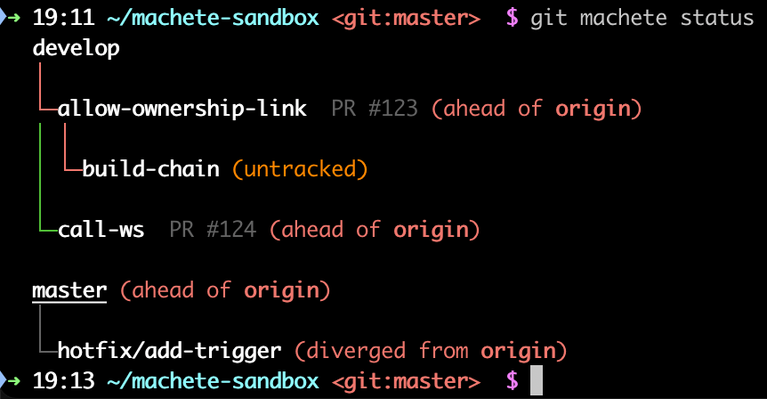
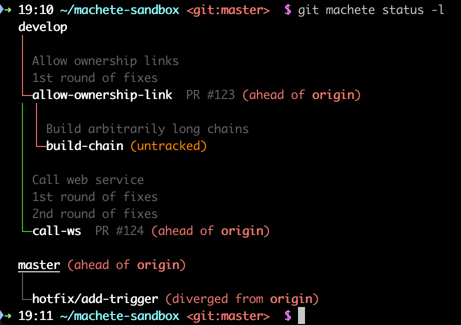

# Tutorial - Part 4: Understanding `status`

The most frequently used command in `git-machete` is:
```shell
git machete status
```
It provides a "bird's eye view" of your repository.

### Color-coded edges - sync to parent status

When you run `status`, you'll see your branch tree with colored edges (the lines connecting branches):



* Green - the branch is in sync with its parent.
* Red - the branch is out of sync with its parent.
  The parent has commits that are not yet in the child branch.
  This branch can be rebased onto its parent.
* Gray - the branch is merged into its parent.
  It can be safely "slid out" (more on that [later](11-cleaning-up-with-slide-out.md)).
* Yellow (not shown above) - the branch is in sync with its parent, but its fork point is off.
  This is a rare edge case.
  It usually means that the unique history of this branch starts at a later commit than its parent's tip.
  For more details, see the [docs on fork points](https://git-machete.readthedocs.io/en/stable/#fork-point) (advanced content).

### Sync to remote status

In addition to the colored edges showing sync status with parent branches, `status` also displays the relationship between each branch and its remote counterpart:

* (nothing) - the branch is in sync with its remote tracking branch.
* `untracked` - the branch has no remote tracking branch configured.
* `ahead of <remote>` - the local branch has commits that haven't been pushed to the remote yet.
* `behind <remote>` - the remote branch has commits that aren't in the local branch yet.
  You should pull or fetch to get these changes.
* `diverged from [& older than] <remote>` - both the local and remote branches have unique commits.
  The optional "& older than" part means the most recent commit on the local branch is older than the most recent commit on the remote.

This information helps you keep your branches in sync with their remote counterparts.

### Listing commits

To see exactly what's on each branch, use:
```shell
git machete status --list-commits
```
(or `git machete s -l` for short).

This will list the commits that are unique to each branch.

### Example output



The underlined branch is currently checked out.

[< Previous: Discovering and editing branch layout](03-discovering-and-editing-branch-layout.md) | [Next: Using branch annotations >](05-using-branch-annotations.md)
