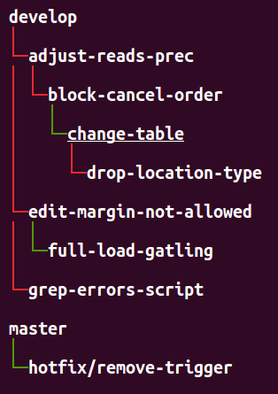
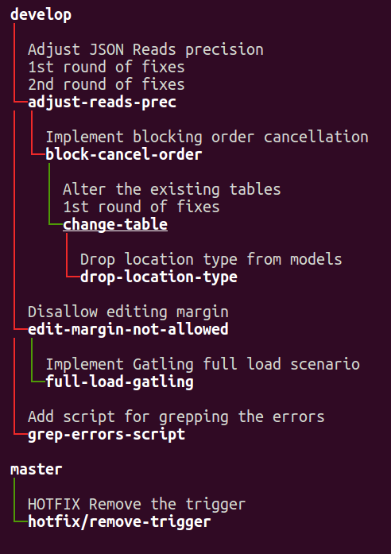

# Tutorial - Part 4: Understanding `status`

The most frequently used command in `git-machete` is:
```shell
git machete status
```
It provides a "bird's eye view" of your repository.

### Color-coded `status`

When you run `status`, you'll see your branch tree with colored edges (the lines connecting branches):



* Green — the branch is in sync with its parent.
* Red — the branch is out of sync.
  The parent has commits that are not yet in the child branch.
  This branch can be rebased onto its parent.
* Gray (not shown above) — the branch is merged into its parent.
  It can be safely "slid out" (more on that later).
* Yellow (not shown above) — the branch is in sync with its parent, but its fork point is off.
  This is a rare edge case.
  It usually means that the unique history of this branch starts at a different commit than its parent's tip.
  For more details, see the [docs on fork points](https://git-machete.readthedocs.io/en/stable/#fork-point) (advanced content).

### Listing commits

To see exactly what's on each branch, use:
```shell
git machete status --list-commits
```
(or `git machete s -l` for short).

This will list the commits that are unique to each branch.
It's a great way to quickly remind yourself what you were working on in each branch.

### Example output



The underlined branch is the one you are currently on.

[< Previous: Discovering branch layout](03-discovering-branch-layout.md) | [Next: Using branch annotations >](05-using-branch-annotations.md)
