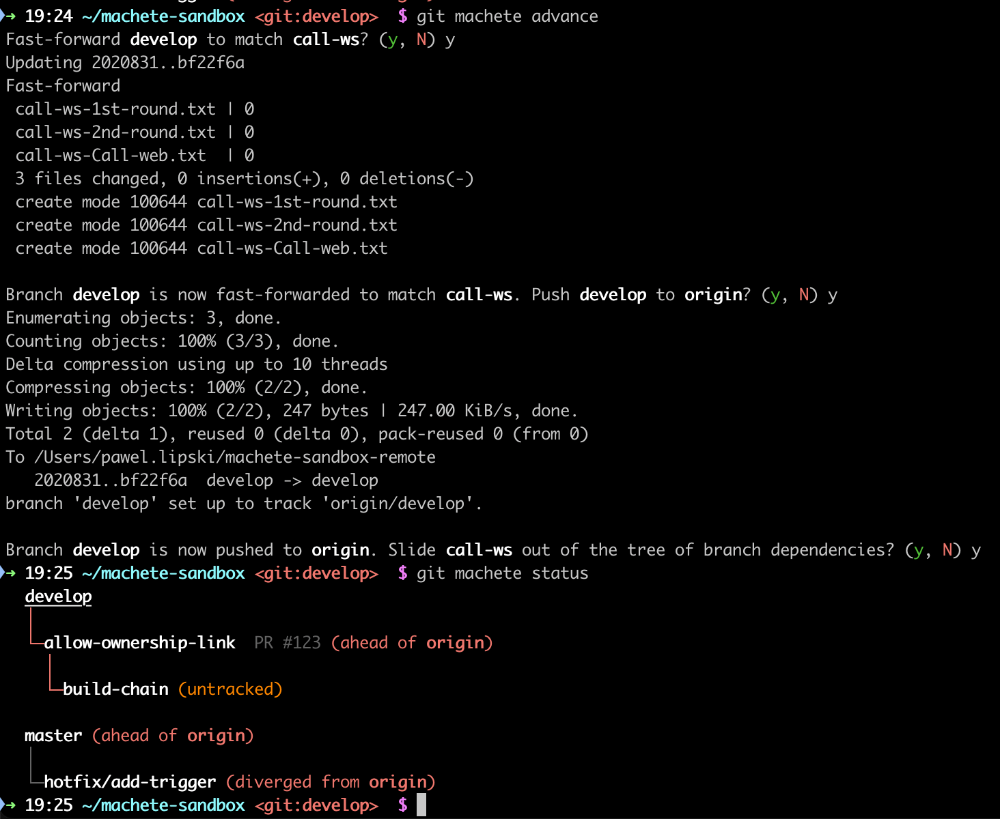

# Tutorial - Part 10: Fast-forwarding with `advance`

Once you've finished work on a child branch and want to merge it into its parent,
you might want to do a fast-forward merge to keep the history linear.

### The `advance` command

When you are on a parent branch (e.g., `develop`),
and you want to fast-forward it to its child branch, run:

```shell
git machete advance
```

### How it works

1.  Checks whether the current branch has exactly one child branch.
2.  If there are multiple children, prompts you to choose one.
3.  Fast-forwards the current branch to the selected child.
4.  Optionally pushes the parent branch to the remote.
5.  Optionally slides out the child branch from the layout (since its commits are now part of the parent).

### Example

Before `git machete advance`:


Check out `develop` and run `git machete advance` and confirm the suggested actions:

After `git machete advance`:



The `call-ws` branch is now merged into `develop` and removed from the machete layout.

[< Previous: Automating workflow with `traverse`](09-automating-workflow-with-traverse.md) | [Next: Cleaning up with `slide-out` >](11-cleaning-up-with-slide-out.md)
