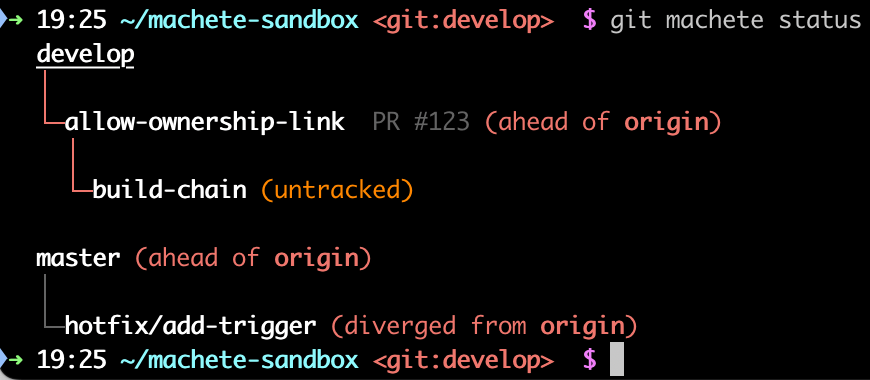
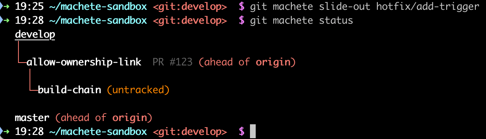

# Tutorial - Part 11: Cleaning up with `slide-out`

When a feature branch is merged into its parent, it usually appears in `git machete status` with a **gray edge**.
This means the branch is no longer needed in the layout.

### The `slide-out` command

To remove a merged branch from the layout and connect its children directly to its parent, use:

```shell
git machete slide-out [<branch1> [<branch2>...]]
```

### What it does

1.  Removes the current branch from the `.git/machete` file.
2.  If the branch had any children, they are now attached to the parent of the removed branch.
3.  By default, rebases these children onto their new parent (skip with `--no-rebase`).
4.  Optionally deletes the slid-out branch locally from git (use `--delete`).

### Example

Before `slide-out`:



After `git machete slide-out hotfix/add-trigger`:



[< Previous: Fast-forwarding with `advance`](10-fast-forwarding-with-advance.md) | [Next: GitHub/GitLab integration >](12-github-gitlab-integration.md)
