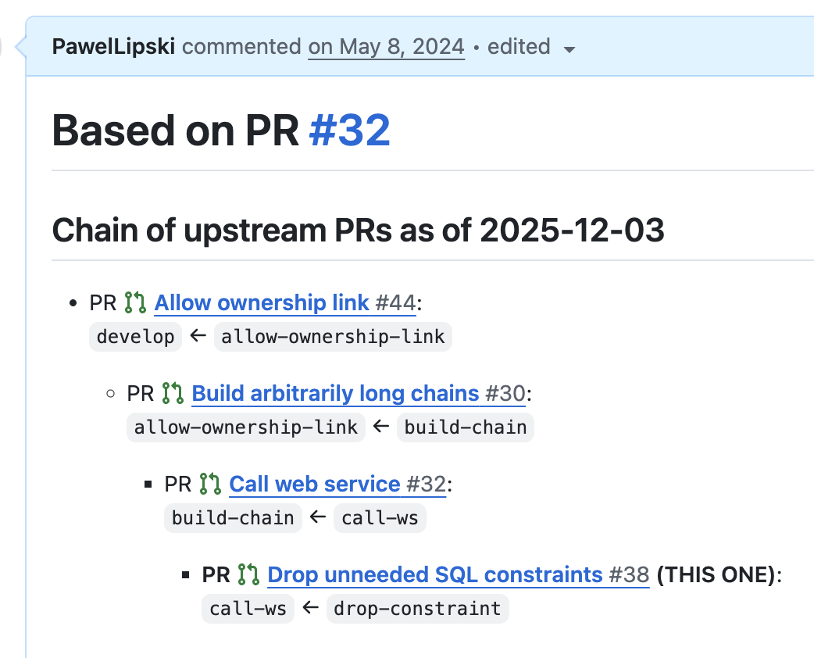

# Tutorial - Part 12: GitHub/GitLab integration

`git-machete` is particularly useful when working with GitHub's Pull Requests (PRs) or GitLab's Merge Requests (MRs).

### Authorization

To perform actions like opening a PR or checking out private repositories, `git-machete` needs an API token.
It will look for a token in the following places (in order):
1.  `GITHUB_TOKEN` (or `GITLAB_TOKEN`) environment variable.
2.  `.github-token` (or `.gitlab-token`) file in your home directory.
3.  `gh` (or `glab`) CLI's authentication token.

If you have the `gh` or `glab` CLI tool installed and logged in, things should "just work" out of the box.

From now on, we'll focus on `git machete github`; the CLI for `gitlab` is very similar (with `-mr` instead of `-pr`).

### Checking out PRs/MRs

You can check out PRs from GitHub and automatically add them to your machete layout.

To check out all PRs opened by you:
```shell
git machete github checkout-prs --mine
```

To check out all PRs authored by a specific user:
```shell
git machete github checkout-prs --by=<github-login>
```

Or to check out specific PRs by their numbers:
```shell
git machete github checkout-prs 123 125
```

When you check out someone else's PR, `git-machete` automatically adds `rebase=no push=no` annotations to these branches.
This prevents git-machete from accidentally rebasing or pushing to someone else's branch during a `traverse`.

### Creating PRs/MRs

To create a PR from your current branch:
```shell
git machete github create-pr [--draft]
```
`git-machete` will:
1.  Identify the parent branch from your layout, to use it as the base for the PR.
2.  Push the branch to the remote (if needed).
3.  Create the PR via the API.

### Retargeting PRs

If you change the parent of a branch in your layout (e.g., using `git machete edit`), the PR's base on GitHub might become outdated.
To fix this, run:
```shell
git machete github retarget-pr
```
This will update the PR's base branch on GitHub to match the parent in your `git-machete` layout.

### Syncing annotations

To update your layout with PR numbers and authors for all branches, run:
```shell
git machete github anno-prs
```
This is a great way to quickly see which branches have open PRs in your `status` output.

### PR chains

When you create or retarget a PR that is part of a stack, `git-machete` automatically includes a "PR chain" in the description:



This list of dependent PRs helps reviewers see the bigger picture and navigate the stack from the browser.

[< Previous: Cleaning up with `slide-out`](11-cleaning-up-with-slide-out.md) | [Next: Conclusion and next steps >](13-conclusion.md)
